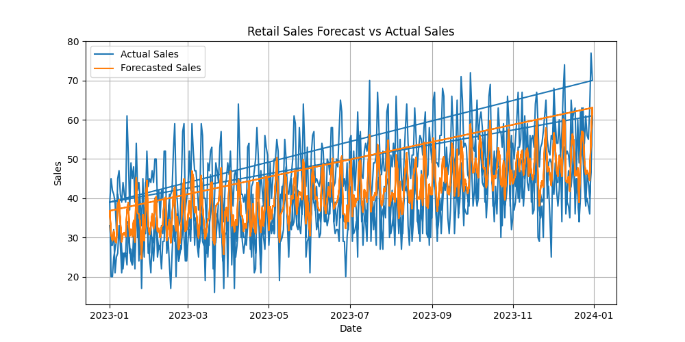
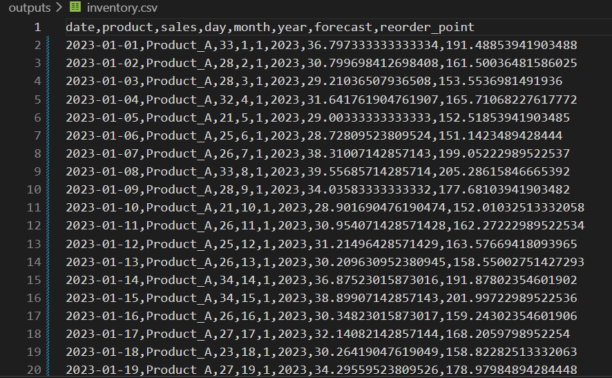

 Retail Sales Forecasting & Inventory Optimization System

 Project Overview

This project is an end-to-end retail analytics system that predicts product demand and optimizes inventory using machine learning and statistical logic.

It helps businesses make data-driven decisions to maintain optimal stock levels and improve profitability.

 Problem Statement

Retail businesses often face two major challenges:

* Stockouts → Loss of sales due to insufficient inventory
* Overstocking → Increased storage cost and wastage

This project solves both problems by forecasting demand and recommending when to reorder products.

 Industry Relevance

This type of system is widely used in:

* E-commerce platforms
* Supermarkets and retail chains
* Supply chain and logistics companies

It is critical for companies like Amazon, Walmart, and Flipkart.

 Business Value

* Improves demand forecasting accuracy
* Reduces inventory costs
* Prevents stockouts
* Enables smarter supply chain decisions

 Tech Stack

* Python
* Pandas, NumPy
* Matplotlib, Seaborn
* Scikit-learn

 Project Architecture

Data → Preprocessing → Feature Engineering → Forecast Model → Inventory Optimization → Visualization

Folder Structure

Retail-Sales-Forecasting/
│
├── data/
│   ├── raw/
│   ├── processed/
│
├── src/
├── outputs/
├── images/
├── main.py
├── requirements.txt
└── README.md

 Dataset

* Synthetic dataset generated using:

  * Trend 📈
  * Seasonality 🔁
  * Random noise 🎲

This simulates real-world retail sales behavior.

 How to Run the Project

Step 1: Generate dataset
python src/generate_data.py

Step 2: Run full pipeline
python main.py

 Workflow

1. Generate synthetic retail dataset
2. Preprocess and clean data
3. Perform feature engineering
4. Train forecasting model
5. Predict sales demand
6. Calculate reorder point & safety stock
7. Generate inventory recommendations

 Forecast Visualization

*Figure: Actual vs Forecasted Sales Trend*

 Inventory Optimization Output

*Figure: Inventory recommendations with reorder logic*

Results

* Successfully predicted sales demand
* Generated reorder points for inventory planning
* Provided actionable insights for stock management

 Future Improvements

* Forecast future dates (next 30 days)
* Add real-time data integration
* Build interactive dashboard using Streamlit
* Implement advanced models (ARIMA, Prophet, LSTM)

 Learning Outcomes

* Time series forecasting
* Inventory optimization techniques
* Data pipeline development
* Business-focused analytics thinking

 Author

Afrah Fathima K S
GitHub: https://github.com/afrah-fks
